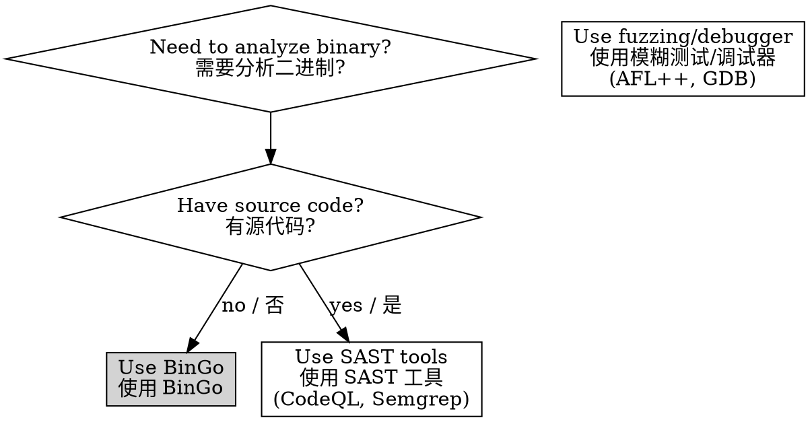

# BinGo - Binary Vulnerability Mining Made Easy / 二进制漏洞挖掘工具

## Overview / 概述

BinGo is a user-friendly, modular binary vulnerability analysis platform that combines Joern's native binary-to-CPG conversion, taint analysis, and strict audit enforcement to detect security flaws in compiled binaries.

BinGo 是用户友好的模块化二进制漏洞分析平台，结合 Joern 原生二进制到 CPG 转换、污点分析和严格审计强制执行，检测编译型二进制文件中的安全漏洞。

**Requirements:** Joern CLI with binary2cpg (REQUIRED - no alternatives, no fallback)
**Mandatory:** Joern must be used for ALL CPG construction and taint analysis
**支持格式 / Formats:** ELF, PE, Mach-O
**License:** Apache-2.0
**Version:** 4.1.0

## Modular Skills / 模块化技能

BinGo provides 9 modular skills for flexible vulnerability analysis:

### Core Analysis Skills / 核心分析技能

| Skill / 技能 | Purpose / 目的 | Use When / 使用场景 |
|-------------|--------------|-------------------|
| **binary-analysis** | Fast binary metadata extraction | User mentions binary, ELF, PE, architecture, security features |
| **cpg-construction** | Joern CPG building (MANDATORY) | "Build CPG", after binary-analysis |
| **source-sink-discovery** | Source/sink identification | After CPG construction, before taint analysis |
| **taint-analysis** | Joern taint tracking (MANDATORY) | "Data flow", "taint tracking", after source discovery |
| **vuln-audit** | STRICT vulnerability audit | "Audit findings", after taint analysis |

### Reporting Skills / 报告技能

| Skill / 技能 | Purpose / 目的 | Use When / 使用场景 |
|-------------|--------------|-------------------|
| **vuln-reporting** | Detailed report generation | "Generate report", after vuln-audit |
| **binary-vuln-assessment** | Main workflow orchestrator | "Analyze binary", "find vulnerabilities" |

### Utility Skills / 实用技能

| Skill / 技能 | Purpose / 目的 | Use When / 使用场景 |
|-------------|--------------|-------------------|
| **joern-automation** | Joern installation and execution | "Joern not found", "install Joern" |
| **binary-poc-generator** | Proof-of-concept generation | "Generate PoC", "create exploit" |

## Quick Reference / 快速参考

| Task / 任务 | Command / 命令 | Skill / 技能 | Output / 输出 |
|-------------|----------------|------------|---------------|
| **完整分析** | `./bingo/scripts/analyze.sh binary.elf ./output` | binary-vuln-assessment | `vulnerability_report.md` |
| **Full Analysis** | | | |
| **查看信息** | `./bingo/scripts/binary_info.sh binary.elf` | binary-analysis | `binary_info.json` |
| **Binary Info** | | | |
| **CPG 构建** | `./bingo/scripts/cpg/build_cpg_native.sh binary.elf cpg.bin` | cpg-construction | `cpg.bin` |
| **CPG Build** | | | |
| **污点分析** | `joern cpg.bin --script dataflow.sc` | taint-analysis | `flows/*.json` |
| **Taint Analysis** | | | |
| **审计** | `./bingo/scripts/agent/validate_findings.sh ./output` | vuln-audit | `confirmed_vulns.json` |
| **Audit** | | | |
| **报告** | `./bingo/scripts/agent/generate_report.sh ./output` | vuln-reporting | `vulnerability_report.md` |
| **Report** | | | |

**Key Files for Review / 关键文件:**
- `vulnerability_report.md` - Final vulnerability report (passed strict audit only) / 最终漏洞报告（仅通过严格审计）
- `cpg.bin` - Code Property Graph from Joern / Joern 生成的代码属性图
- `flows/*.json` - Raw taint flows from Joern / Joern 原始污点流
- `binary_info.json` - Binary metadata / 二进制元数据
- `confirmed_vulns.json` - Vulnerabilities that passed strict audit / 通过严格审计的漏洞

## Workflow / 工作流程

### Complete Analysis Pipeline / 完整分析流水线

```
1. binary-analysis (Fast metadata extraction)
   ↓
2. cpg-construction (Build CPG with Joern)
   ↓
3. source-sink-discovery (Identify sources/sinks)
   ↓
4. taint-analysis (Track data flows)
   ↓
5. vuln-audit (STRICT audit - 5 checks)
   ↓
6. vuln-reporting (Generate report with PoCs)
```

### Orchestrated by / 编排者

**binary-vuln-assessment** - Main skill that orchestrates the complete workflow with quality gates and error recovery.

## When to Use BinGo / 使用场景



**Use BinGo when / 使用 BinGo 当:**
- ✅ Analyzing compiled binary without source code / 分析没有源代码的二进制
- ✅ Need static analysis with taint tracking / 需要带污点追踪的静态分析
- ✅ Generating PoC exploits / 生成漏洞利用 PoC
- ✅ STRICT vulnerability auditing required / 需要严格漏洞审计

**Don't use when / 不使用当:**
- ❌ Source code available / 有源代码 → Use SAST tools (CodeQL, Semgrep)
- ❌ Need runtime behavior / 需要运行时行为 → Use fuzzing (AFL++), debugger (GDB)
- ❌ Simple string analysis / 简单字符串分析 → Use `strings`, `grep`

## Common Use Cases / 常见场景

**场景 1: 路由器固件漏洞分析 / Router Firmware Analysis**
```bash
./bingo/scripts/analyze.sh /path/to/router_firmware.bin ./router_analysis
# Detects: Command injection, buffer overflow
# 检测: 命令注入、缓冲区溢出
```

**场景 2: IoT 设备二进制分析 / IoT Device Binary**
```bash
./bingo/scripts/binary_info.sh iot_device.elf
# Shows: Architecture, security protections, function list
# 显示: 架构、安全保护、函数列表
```

**场景 3: 特定函数手动分析 / Manual Function Analysis**
```bash
# 1. Build CPG with Joern / 使用 Joern 构建 CPG
./bingo/scripts/cpg/build_cpg_native.sh binary.elf cpg.bin

# 2. Manually identify source/sink functions / 手动识别源/汇函数

# 3. Use Joern to query data flow / 使用 Joern 查询数据流
joern cpg.bin --script bingo/scripts/joern/dataflow.sc
```

## MANDATORY: Joern Usage / 必须使用 Joern

**CRITICAL:** Joern is NOT optional. All analysis MUST use Joern.
**关键：** Joern 不是可选项。所有分析必须使用 Joern。

### Why Joern is Mandatory / 为什么必须使用 Joern

1. **Native binary analysis** - binary2cpg directly converts binaries to CPG / 原生二进制分析 - binary2cpg 直接将二进制转换为 CPG
2. **Proven taint tracking** - Reliable data flow analysis / 经过验证的污点追踪 - 可靠的数据流分析
3. **No decompilation needed** - Works directly on binary code / 无需反编译 - 直接在二进制代码上工作

### No Exceptions / 无例外

- ❌ No Ghidra-based CPG construction / 不使用基于 Ghidra 的 CPG 构建
- ❌ No manual decompilation workflow / 不使用手动反编译工作流
- ❌ No alternative taint analysis tools / 不使用其他污点分析工具
- ✅ ONLY Joern binary2cpg + Joern taint tracking / 仅使用 Joern binary2cpg + Joern 污点追踪

## Quick Start / 快速开始

### Complete Analysis / 完整分析流程

```bash
# Analyze binary (complete pipeline) / 分析二进制（完整流水线）
./bingo/scripts/analyze.sh /path/to/binary.elf ./output

# Report generated at: / 报告生成于:
# ./output/vulnerability_report.md
```

### Step-by-Step / 分步分析

```bash
# 1. Fast binary info collection / 快速二进制信息收集
./bingo/scripts/binary_info.sh binary.elf
# Output: File type, architecture, security features, functions
# 输出: 文件类型、架构、安全特性、函数

# 2. Build CPG with Joern / 使用 Joern 构建 CPG
./bingo/scripts/cpg/build_cpg_native.sh binary.elf cpg.bin
# Output: Code Property Graph for taint analysis
# 输出：用于污点分析的代码属性图

# 3. Taint analysis / 污点分析
# Use Joern to track data flow: source → sink
# 使用 Joern 追踪数据流：源 → 汇
joern cpg.bin --script bingo/scripts/joern/dataflow.sc sources.json sinks.json flows/

# 4. Generate report / 生成报告
# Run strict audit on flows → Confirm only verified vulnerabilities → Generate PoC
# 对流进行严格审计 → 仅确认已验证的漏洞 → 生成 PoC
```

## Output Structure / 输出结构

```
output/
├── binary_info.json           # Binary metadata / 二进制元数据
├── sources.json               # Identified source functions / 识别的源函数
├── sinks.json                 # Identified sink functions / 识别的汇函数
├── cpg.bin                    # Code Property Graph (Joern binary2cpg) / 代码属性图
├── cpg-validation.txt         # CPG statistics / CPG 统计
├── flows/                     # Raw taint flows from Joern / Joern 原始污点流
│   ├── flow_001.json
│   └── flow_002.json
├── confirmed_vulns.json       # Vulnerabilities that passed strict audit / 通过严格审计的漏洞
└── vulnerability_report.md    # Final report with PoCs / 最终报告（含 PoC）
```

## Terminology / 术语对照

| English | 中文 | Description / 说明 |
|---------|------|-------------------|
| **Source Function** | 源函数 | Functions that introduce untrusted data (e.g., recv, getenv) / 引入不可信数据的函数 |
| **Sink Function** | 汇函数 | Dangerous operation functions (e.g., strcpy, system) / 危险操作函数 |
| **Taint Analysis** | 污点分析 | Analysis method tracking untrusted data flow / 追踪不可信数据流动的分析方法 |
| **Data Flow** | 数据流 | Path of data movement through the program / 数据在程序中的传递路径 |
| **Buffer Overflow** | 缓冲区溢出 | Writing more data than buffer size / 写入超过缓冲区大小的数据 |
| **Format String** | 格式化字符串 | User input controls printf format parameter / 用户输入控制 printf 格式化参数 |
| **Command Injection** | 命令注入 | User input reaches shell execution / 用户输入到达 shell 执行 |
| **Code Property Graph (CPG)** | 代码属性图 | Graph structure for code analysis / 用于代码分析的图结构 |
| **Pseudo-code** | 伪代码 | C-like code from decompilation / 反编译后的类 C 代码 |
| **Reachability** | 可达性 | Whether data can flow from source to sink / 数据能否从源流向汇 |

## Key Concepts / 关键概念

### Source Functions / 源函数

Functions that introduce untrusted data into the program.
引入不可信数据到程序中的函数。

Examples: `recv`, `scanf`, `getenv`, `fread`

### Sink Functions / 汇函数

Dangerous operations that can be exploited.
可被利用的危险操作。

Examples: `strcpy` (buffer overflow), `system` (command injection), `printf` (format string)

### Taint Analysis / 污点分析

Tracking data flow from untrusted sources to dangerous sinks.
追踪从不可信源到危险汇的数据流。

### STRICT Audit / 严格审计

All 5 checks must pass before confirming vulnerability:
所有 5 项检查必须通过才能确认漏洞：

1. Data flow complete / 数据流完整
2. Source verified / 源已验证
3. Sink verified / 汇已验证
4. Protections absent / 保护缺失
5. False positive ruled out / 误报排除

## Individual Skills / 各个技能

For detailed information on each skill, see the individual SKILL.md files:

### binary-analysis / 二进制分析

**Location:** `skills/binary-analysis/SKILL.md`

Extracts fast binary metadata: file type, architecture, security features (NX, PIE, canary, RELRO).

```
Usage: ./bingo/scripts/binary_info.sh binary.elf
Output: binary_info.json
```

### cpg-construction / CPG 构建

**Location:** `skills/cpg-construction/SKILL.md`

Builds Code Property Graph from binary using Joern binary2cpg (MANDATORY).

```
Usage: ./bingo/scripts/cpg/build_cpg_native.sh binary.elf cpg.bin
Output: cpg.bin, cpg-validation.txt
Quality gate: > 100 nodes
```

### source-sink-discovery / 源汇函数发现

**Location:** `skills/source-sink-discovery/SKILL.md`

Identifies source functions (untrusted input) and sink functions (dangerous operations).

```
Usage: joern cpg.bin --script discover_sources.sc
Output: sources.json, sinks.json
Method: Built-in definitions + LLM discovery
```

### taint-analysis / 污点分析

**Location:** `skills/taint-analysis/SKILL.md`

Tracks data flow from sources to sinks using Joern taint tracking (MANDATORY).

```
Usage: joern cpg.bin --script dataflow.sc sources.json sinks.json flows/
Output: flows/flow_*.json
```

### vuln-audit / 漏洞审计

**Location:** `skills/vuln-audit/SKILL.md`

STRICT audit enforcement - all 5 checks must pass.

```
Usage: ./bingo/scripts/agent/validate_findings.sh ./output
Output: confirmed_vulns.json
Checks: 5 mandatory (data flow, source, sink, protections, false positive)
```

### vuln-reporting / 漏洞报告

**Location:** `skills/vuln-reporting/SKILL.md`

Generates detailed reports with complete pseudo-code paths and PoCs.

```
Usage: ./bingo/scripts/agent/generate_report.sh ./output
Output: vulnerability_report.md
Evidence: Complete pseudo-code paths, data flow diagrams, PoCs
```

### binary-vuln-assessment / 二进制漏洞评估

**Location:** `skills/binary-vuln-assessment/SKILL.md`

Main orchestrator - runs complete workflow with quality gates.

```
Usage: ./bingo/scripts/analyze.sh binary.elf ./output
Orchestrates: All 6 core skills in sequence
Quality gates: CPG validation, audit enforcement, evidence completeness
```

### joern-automation / Joern 自动化

**Location:** `skills/joern-automation/SKILL.md`

Manages Joern installation, validation, and execution.

```
Usage: ./bingo/scripts/joern/validate_joern.sh
Provides: Installation check, JVM memory management, script wrappers
```

### binary-poc-generator / PoC 生成器

**Location:** `skills/binary-poc-generator/SKILL.md`

Generates executable proof-of-concept exploits.

```
Usage: ./bingo/scripts/agent/generate_poc.sh vulnerability.json
Output: pocs/*.py, pocs/*.c, pocs/*.sh
Types: Buffer overflow, format string, command injection, integer overflow
```

## References / 参考

| File / 文件 | Content / 内容 |
|------------|--------------|
| `references/sources.md` | Source function definitions / 源函数定义 |
| `references/sinks.md` | Sink function definitions / 汇函数定义 |
| `references/vuln_patterns.md` | Vulnerability patterns / 漏洞模式 |
| `references/evidence_generation.md` | Complete evidence guidelines / 完整证据指南 |

## Installation / 安装

```bash
# 1. Install Joern (REQUIRED) / 安装 Joern（必须）
git clone https://github.com/joernio/joern ~/joern
cd ~/joern && ./build.sh
export PATH=$PATH:~/joern

# 2. Verify installation / 验证安装
joern --version

# 3. Run BinGo / 运行 BinGo
./bingo/scripts/analyze.sh binary.elf ./output
```

**See:** `skills/joern-automation/SKILL.md` for detailed installation instructions.

## Support / 支持

- **Documentation:** See individual `SKILL.md` files for each skill / 查看各个技能的 `SKILL.md` 文件
- **Installation:** `skills/joern-automation/SKILL.md`
- **Workflow:** `skills/binary-vuln-assessment/SKILL.md`
- **Audit:** `skills/vuln-audit/SKILL.md`

## Version / 版本

4.1.0 - Restructured to match superpowers reference architecture: skills moved to skills/ directory, added agents/, commands/, docs/, hooks/, lib/, .claude-plugin/ directories, enhanced test infrastructure
/ 重构为匹配 superpowers 参考架构：技能移至 skills/ 目录，新增 agents/, commands/, docs/, hooks/, lib/, .claude-plugin/ 目录，增强测试基础设施

4.0.0 - Rebrand from VulRe to BinGo with enhanced user experience, improved documentation, better error messages, and 5-minute quick start
/ 从 VulRe 重新品牌为 BinGo，增强用户体验、改进文档、更好的错误消息和 5 分钟快速入门
